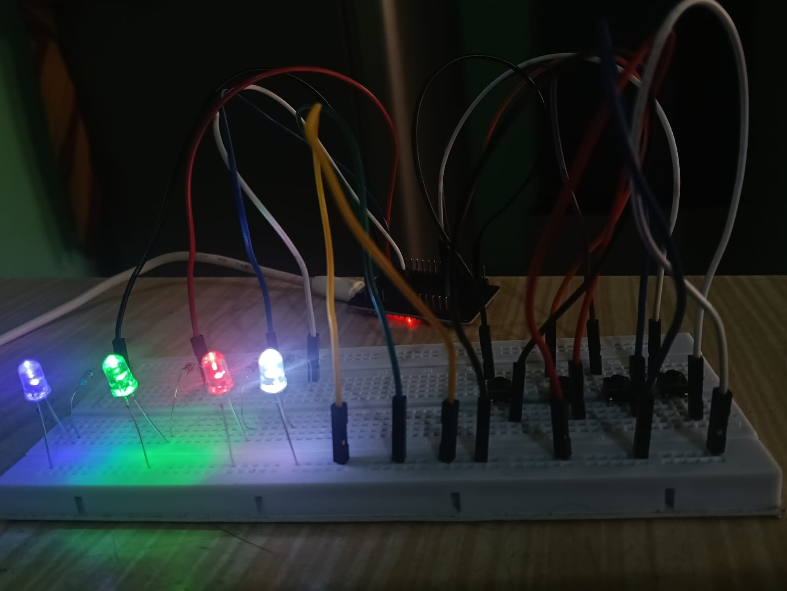
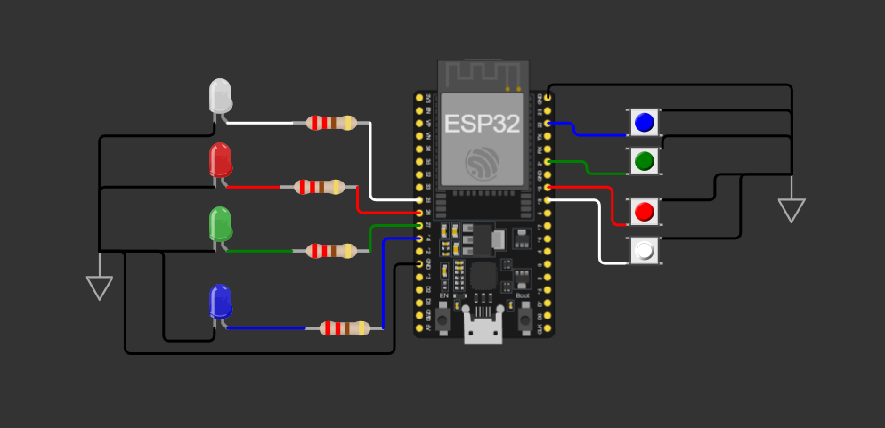
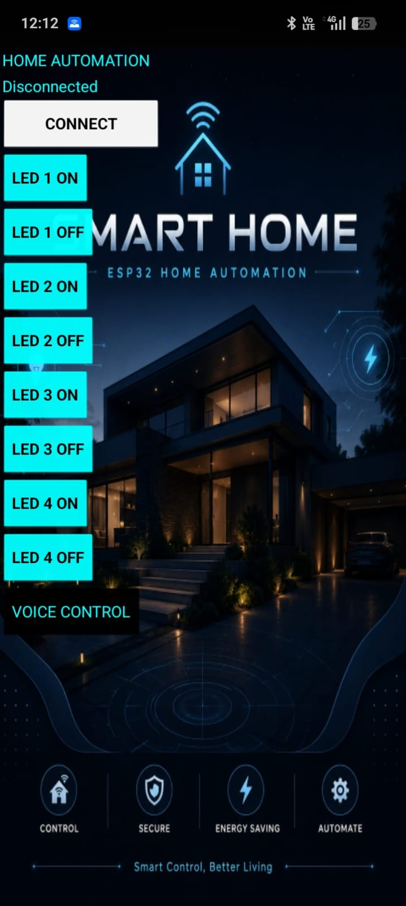

# 🏠 Smart Home Automation using ESP32

A smart home automation project built using an **ESP32**, **Bluetooth Low Energy (BLE)**, and an **Android application developed with MIT App Inventor**.

The system allows four LED-based appliances to be controlled using physical push buttons, a mobile application, and voice commands.

---

## ✨ Features

- 🔌 Control of 4 LED-based appliances
- 🎛️ Manual control using physical push buttons
- 📱 Android mobile application
- 🔵 Bluetooth Low Energy (BLE) communication
- 🎤 Voice-based control
- ⚡ ESP32-based embedded control
- 💡 LED ON/OFF status indicators
- 🎨 Custom mobile app interface

---

## 🛠️ Components Required

- ESP32 development board
- 4 × LEDs
- 4 × Push buttons
- Resistors
- Breadboard
- Jumper wires
- Android smartphone

---

## 🔧 Hardware Setup

Here is the hardware implementation of the project:



---

## 🔌 Circuit Diagram

The circuit connects the ESP32 with four LEDs and four push buttons for appliance control.



---

### 📱 App Interface

Here’s a preview of the smart home automation app I built, showcasing the main interface used to monitor and control connected devices throughout the home.



---
🎥 Project Demonstration

The complete working demonstration of the Smart Home Automation system is available below.

The demo showcases:

📱 Android application interface
🔵 BLE connection between the app and ESP32
💡 Individual LED ON/OFF control
🎤 Voice-controlled LED operation
🔘 Physical push-button control
⚡ Real-time response of the ESP32 hardware
🎬 Demo Video

The demonstration video is available in this repository as `Smart-Home-Demo.mp4`.
---
# 📁 Files Included

The repository contains the following project files and resources:

- 📱 **Android App (`.apk`)** — Installable Android application for controlling the smart home system.
- 🧩 **MIT App Inventor Project (`.aia`)** — Complete source project of the Android application.
- 💻 **ESP32 Source Code** — Program used to control the LEDs, receive BLE commands and handle physical buttons.
- 🔌 **Circuit Diagram** — Schematic showing the connections between the ESP32, LEDs and other components.
- 🖼️ **Hardware Images** — Images of the actual hardware setup and prototype.
- 🎬 **Smart-Home-Demo.mp4** — Demonstration video showing the complete working system.
- 🎨 **App Assets** — Backgrounds, LED ON/OFF icons and other graphical resources used in the application.
- 📖 **README.md** — Complete documentation of the project, setup, features and implementation.

---

## 🔄 Working Principle

The system has three control methods:

```text
                    ┌───────────────┐
Physical Buttons ──►│               │
                    │     ESP32     │──► LED 1
Mobile App ────────►│               │──► LED 2
                    │               │──► LED 3
Voice Commands ────►│               │──► LED 4
                    └───────────────┘
```
---
# 🚀 Project Overview

The main goal of this project is to demonstrate how an ESP32 can be connected to a custom mobile application through Bluetooth Low Energy and controlled using both manual and voice-based commands.

The system consists of three main parts:

```text
                        ┌─────────────────────┐
                 │     ANDROID APP     │
                 │                     │
                 │  LED 1  ON / OFF    │
                 │  LED 2  ON / OFF    │
                 │  LED 3  ON / OFF    │
                 │  LED 4  ON / OFF    │
                 │                     │
                 │  🎤 Voice Control   │
                 └──────────┬──────────┘
                            │
                         BLE │
                            ▼
                 ┌─────────────────────┐
                 │        ESP32        │
                 │                     │
                 │  BLE Communication  │
                 │  Button Processing │
                 │  Command Handling  │
                 └──────────┬──────────┘
                            │
             ┌──────────────┼──────────────┐
             ▼              ▼              ▼
           💡 LED 1       💡 LED 2       💡 LED 3       💡 LED 4
```
---

# 🎓 Learning Outcomes

Through this project, the following concepts and practical skills were developed:

- 🔧 **ESP32 Programming** — Learned how to program and control an ESP32-based embedded system.
- 📡 **Bluetooth Low Energy (BLE)** — Learned how to establish BLE communication between an Android application and ESP32.
- 📱 **Android App Development** — Learned how to create an Android control application using MIT App Inventor.
- 🎤 **Voice Recognition** — Implemented voice commands to control LEDs through the Android application.
- 💡 **GPIO Control** — Learned how to control LEDs and read physical push-button inputs using ESP32 GPIO pins.
- 🔄 **Real-Time Communication** — Understood how commands from the mobile application can produce immediate hardware responses.
- 🔌 **Circuit Design** — Gained practical experience in connecting electronic components with an ESP32.
- 🧠 **Problem Solving** — Debugged BLE connection, voice-recognition and hardware-control issues during development.
- 🎨 **UI/UX Design** — Learned how to design a functional and visually appealing mobile control interface.
- 🤖 **IoT Fundamentals** — Developed an understanding of how mobile applications, wireless communication and embedded hardware can work together in a smart-home system.
- 🛠️ **Hardware–Software Integration** — Learned how to integrate an Android application with physical hardware to create a complete working system.

---  
## 👩‍💻 Author

**Sanjana N**

Electronics and Communication Engineering (ECE) Student

Learning Arduino, Embedded Systems, and Electronics Projects 
